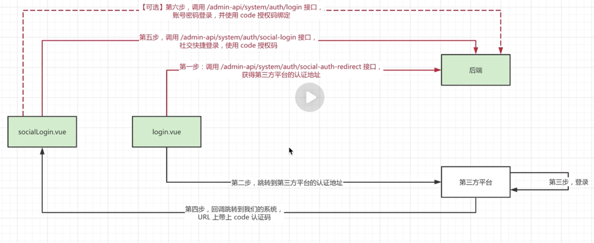
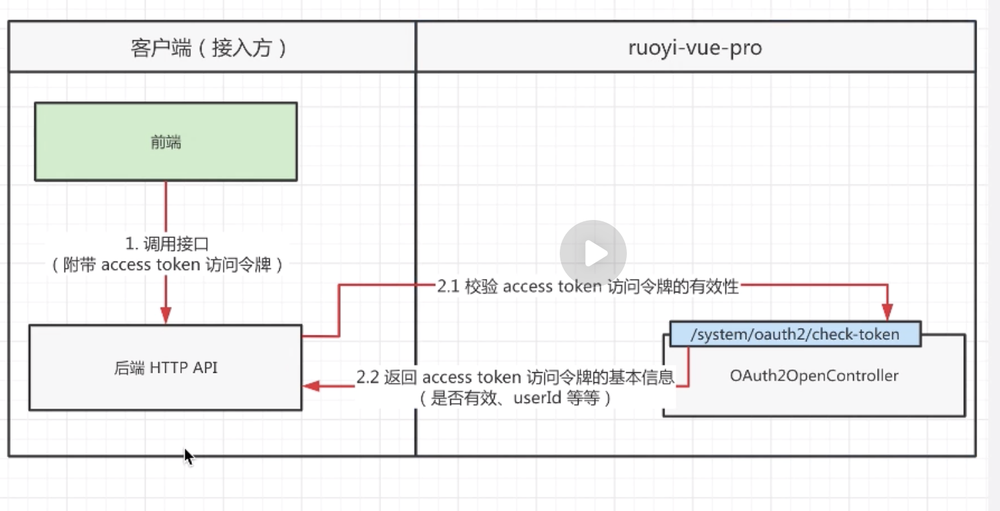

## 项目笔记

1. 用户登录系统逻辑

   账号密码登陆，验证码校验，账号校验，生成相关token返回，记录相关日志。

2. 短信登录逻辑

   获得验证码，落库，校验验证码，校验账户，添加相关风控，记录日志，前端把token存储到localstorage中。

3. 用户登出

   移除token，记录登出日志（…ip,浏览器等），登出有多种类型，主动/被动强制

4. 如何生成用户认证token

   对应两张表。access token 和refresh token。 提高相对的安全性

   逻辑其实不难

5. 如何校验token

前端在请求头传递token

这段逻辑在过滤器里进行  TokenAuthenticationFilter

主要是获取token，校验token，构建在线用户。

6. 如何刷新token

主要通过如下接口

```java
@PostMapping("/refresh-token")
@PermitAll
@Operation(summary = "刷新令牌")
@Parameter(name = "refreshToken", description = "刷新令牌", required = true)
@OperateLog(enable = false) // 避免 Post 请求被记录操作日志
public CommonResult<AuthLoginRespVO> refreshToken(@RequestParam("refreshToken") String refreshToken) {
    return success(authService.refreshToken(refreshToken));
}
```

大概思路：根据刷新令牌查询访问令牌，删除然后重新创建访问令牌。

如果刷新令牌过期了，则重新生产刷新令牌。


7. 如何模拟用户token

TokenAuthenticationFilter的mockLoginUser接口实现

在SecurityProperties类里配置mockenable的属性为true，mockSecret是请求头标示


8. 如何实现特定url免登录

逻辑在YudaoWebSecurityConfigurerAdapter( 自定义的 Spring Security 配置适配器实现)

通过filterChain方法实现（这里代码和设计思想非常的优雅，高效地实现了免登录逻辑）

主要是先拿到所有控制器，然后判断是否还有pemitAll注解

然后把对应的URL存起来，最后进行配置

**并设置app的URL是无需登录的**


每个项目也可以自定义自己的规则

以及兜底规则


#### AuthController

位置yudao.module.system.controller.admin.auth.AuthController

**这是系统认证相关的控制器**

包含系统的主要认证相关接口： 登录接口，登出接口，刷新令牌，获取权限，短信登陆，发送短信，

其他社交网站登陆


9. 实现第三方登录

   流程：


调用后端接口，返回跳转地址，访问该地址，跳转到第三方平台![屏幕快照 2024-02-06 10.56.52]

登录后回调到系统并携带code，然后调用系统的社交登录接口（之后）或者code绑定接口进行绑定（首次）




项目中使用了**justAuth组件**，实现了第三方登录的集成


10. Oauth2获取到token后，访问时如何校验token有效性

流程如下图：




11. 当令牌过期时，如何刷新token

流程和上图差不多

```
OAuth2OpenController
```


12. s so，客户端如何获取用户信息!


拿到token后 客户端 携带token访问授权系统提供的接口（这里也就是ruoyi-pro），然后即可拿到数据。

接口在OAuth2UserController里面


13. 如何实现数据权限


方案一： 直接添加各种where条件


方案二：根据规则 生成where条件，然后重写sql


修改一下
